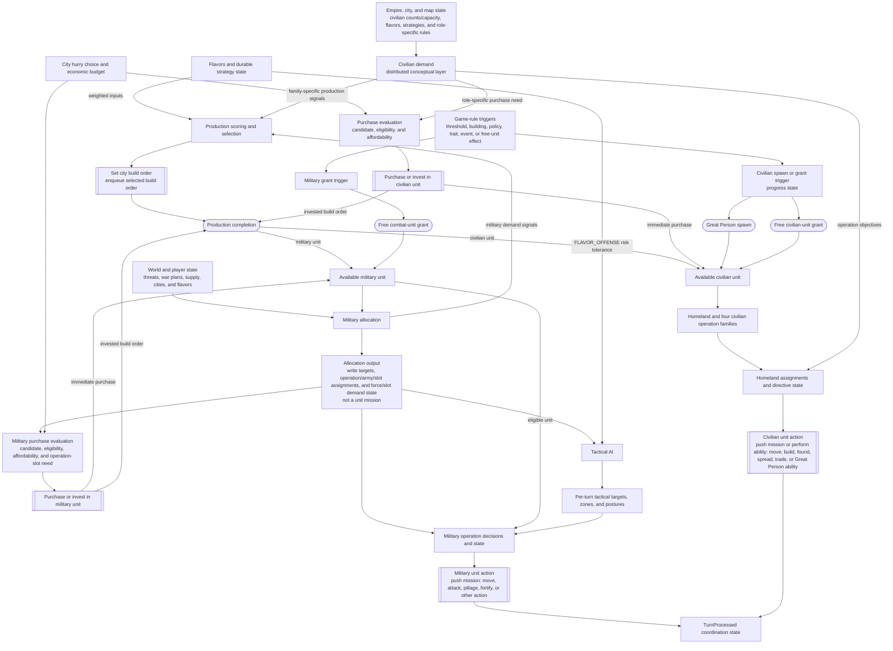

# Civilization V Unit AI: Overview

This page is for contributors who can read C++ but have not yet traced the Vox Deorum DLL. It describes the unit-AI behavior baseline of **Vox Populi 5.2.7**.

The code lives in `civ5-dll/CvGameCoreDLL_Expansion2`. A useful way to orient yourself is to follow four conceptual layers plus a parallel acquisition path:

1. **Production** selects the next buildable for each city.
2. **Civilian demand** combines role-specific needs into production signals, purchase evaluations, and civilian operation objectives.
3. **Allocation** decides how military capacity becomes standing forces, operations, tactical-zone activity, or military units left for Homeland handling. It also produces the military demand signals that production can consume.
4. **Operation** decides what assigned or eligible units do this turn, on either the military or civilian track.

Acquisition is a parallel creation path with separate military and civilian tracks. A role-specific need can start a gold or faith purchase evaluation. A game-rule trigger can instead spawn a Great Person or grant a free military or civilian unit. There is no universal acquisition planner or demand queue. Available military units enter allocation and recruitment, while available civilians enter Homeland processing or one of the four civilian operation families.

Civilian demand is likewise a distributed conceptual layer, not one `CvCivilianDemandAI` class. It performs no player-equivalent action. Automatic Great Person threshold spawns and free-unit grants begin outside this layer.

This is a mental model, not a set of isolated classes. Information and feedback cross the boundaries. For example, allocation demand changes city production weights, an operation can expose a formation slot gap that production should help fill, and tactical results feed the next turn's defense and target assessments.

## The layers at a glance

Legend: double-bordered nodes are player-equivalent in-game actions, plain rectangles are interim AI decisions or coordination state, and rounded nodes are automatic game events.

The layers are not a strict call stack. `CvMilitaryAI::DoTurn` prepares military state and may create or update operations before unit movement. Later, `CvPlayerAI::AI_unitUpdate` runs `CvTacticalAI::Update`, then `CvHomelandAI::Update`, while operations move their armies as part of tactical processing.

## Layer responsibilities

Military and civilian production are two demand tracks feeding the same `CvCityStrategyAI::ChooseProduction` pass, not two independent production passes. Military demand originates in allocation and operation formation state, not production.

The table below is a quick scan; each layer's inputs, outputs, and technical interfaces are detailed in its own section under [Military and civilian tracks](#military-and-civilian-tracks).

| Layer | Role in one line | Player-equivalent in-game action |
| --- | --- | --- |
| Military allocation | Turns threats, war plans, and supply into force targets, operations, armies, and formation-slot demand | None — interim state for production, acquisition, and operations |
| Civilian demand | Emits production signals, purchase needs, and operation objectives from existing role-specific systems | None |
| Military production | Weighs military candidates in the shared city build comparison | Sets the city build order if a military unit wins |
| Civilian production | Weighs civilian candidates in the same comparison | Sets the city build order if a civilian unit wins |
| Military acquisition | Evaluates gold or faith purchases for military needs; tracks free-unit triggers | Purchases or invests in a military unit |
| Civilian acquisition | Evaluates role-specific civilian purchases; tracks Great Person progress and free-unit triggers | Purchases or invests in a civilian unit |
| Military operation | Turns targets, zones, and postures into per-unit choices | Pushes missions such as move, attack, pillage, or fortify |
| Civilian operation | Assigns Homeland roles and moves the four civilian operation families | Pushes missions or performs abilities |

## Military and civilian tracks

### Military allocation

**Conceptual input:** World and player state, existing units, and operation formation gaps. `CvMilitaryAI::DoTurn` coordinates the turn and also dispatches acquisition work.

**Interim output:** Recommended force counts, defense and strategy state, attack targets, operations, armies, and `OperationSlot` gaps. These are demand and assignment state, not unit missions.

**Player-equivalent action:** None.

**Technical interfaces:** `CvMilitaryAI::SetRecommendedArmyNavySize`, `UpdateAttackTargets`, and `UpdateOperations`, together with `CvAIOperation`, `CvArmyAI`, and `OperationSlot`.

### Civilian demand

**Conceptual input:** Empire, city, and map state, including civilian counts and capacity, flavors, strategies, and role-specific rules.

**Interim output:** Family-specific production signals, purchase evaluations, and operation objectives for settlement, improvements, recon, trade, religion, antiquity or culture, diplomacy, and Great People.

**Player-equivalent action:** None.

**Technical interfaces:** Distributed across Economic AI, city strategies, Trade AI, Religion AI, Great Person rules, and related systems.

### Military production

**Conceptual input:** City state, available buildables, flavors, and military demand from allocation or formation gaps.

**Interim output:** Military candidates and weights added to the shared city build comparison.

**Player-equivalent action:** If a military unit wins that comparison, the city receives that unit as its selected build order.

**Technical interfaces:** `CvUnitProductionAI`, `CvCityStrategyAI::ChooseProduction`, and `CvCity::pushOrder`.

### Civilian production

**Conceptual input:** City state, available buildables, flavors, and civilian demand signals for settlement, improvements, recon, trade, religion, antiquity, or diplomacy.

**Interim output:** Civilian candidates and weights added to the same shared city build comparison. Great Person thresholds are handled by acquisition, not this build-order choice.

**Player-equivalent action:** If a civilian unit wins that comparison, the city receives that unit as its selected build order.

**Technical interfaces:** `CvUnitProductionAI`, `CvCityStrategyAI::ChooseProduction`, and `CvCity::pushOrder`.

### Military acquisition

**Conceptual input:** Military demand, especially an operation-slot need, plus available gold or faith. A game-rule trigger can also request a free combat unit without demand.

**Interim output:** Candidate, eligibility, affordability, operation-slot, and purchase-versus-investment decisions. Free-unit rules maintain their own trigger state outside this demand path.

**Player-equivalent action:** Spends currency to purchase a military unit immediately or invest in one and enqueue it for production. A free combat-unit grant is an automatic event. An immediate purchase or grant outputs an available military unit for allocation and recruitment.

**Technical interfaces:** `CvMilitaryAI::MakeEmergencyPurchases`, `CvEconomicAI::DoHurry`, `CvCity::CheckForOperationUnits`, `CvCity::IsCanPurchase`, `CvCity::PurchaseUnit`, `CvCity::SpawnFreeUnit`, and `CvPlayer::addFreeUnit`.

### Civilian acquisition

**Conceptual input:** A role-specific civilian purchase need plus available gold or faith. Great Person progress can instead cross its spawn threshold, and game rules can grant a free civilian unit.

**Interim output:** Candidate, eligibility, affordability, and purchase-versus-investment decisions, plus Great Person progress and free-unit trigger state. `CvPlayerAI::ProcessGreatPeople` assigns directives only after a Great Person exists.

**Player-equivalent action:** Spends currency to purchase a civilian unit immediately or invest in one and enqueue it for production. Great Person spawning and free-unit grants are automatic events. An immediate purchase, spawn, or grant outputs an available civilian unit for Homeland or civilian-operation processing.

**Technical interfaces:** `CvEconomicAI::DoHurry`, `CvReligionAI`, `CvCity::IsCanPurchase`, `CvCity::PurchaseUnit`, `CvCityCitizens::ChangeSpecialistGreatPersonProgressTimes100`, `CvCityCitizens::DoSpawnGreatPerson`, `CvCity::SpawnFreeUnit`, and `CvPlayer::addFreeUnit`.

### Military operation

**Conceptual input:** An assigned army or eligible military unit, its target or objective, and current map state.

**Interim output:** Tactical targets, dominance zones and postures, path steps, attack or defense choices, and `TurnProcessed` coordination state.

**Player-equivalent action:** Pushes missions such as move, attack, pillage, or fortify.

**Technical interfaces:** `CvAIOperation::DoTurn`, `CvArmyAI`, `CvTacticalAI::Update`, `CvTacticalAI::ProcessDominanceZones`, `TacticalAIHelpers::FindBestUnitAssignments`, `CvTacticalAI::PlotOperationalArmyMoves`, and `CvUnit::PushMission`.

### Civilian operation

**Conceptual input:** An available civilian unit, its role or directive, civilian operation objectives, and current map state.

**Interim output:** Homeland assignments, builder directives, trade and religious objectives, civilian operation targets, and `TurnProcessed` coordination state.

**Player-equivalent action:** Pushes missions or performs abilities such as move, build, found, spread, trade, or a Great Person ability.

**Technical interfaces:** `CvHomelandAI::AssignHomelandMoves`, `CvBuilderTaskingAI::ExecuteWorkerMove`, `CvAIOperationCivilian::PerformMission`, `CvTradeAI`, and `CvReligionAI`. The four `CvAIOperationCivilian` families are found city, merchant delegation, diplomat delegation, and musician concert tour.

## Flavors are weighted preferences

Flavors are weighted inputs, not orders. `CvFlavorManager` propagates personality and strategy changes to player and city recipients, while callers of `CvGrandStrategyAI::GetPersonalityAndGrandStrategy` decide where each flavor matters. Availability, sanity checks, map conditions, and competing weights still apply.

> **Vox Deorum:** `CvFlavorManager::SetCustomFlavors` stores custom values, propagates them to player and city recipients, and records when they were set. `CheckCustomFlavorExpiration` removes them after ten turns unless they are replaced. While they are active, `CvGrandStrategyAI::GetPersonalityAndGrandStrategy` returns the custom personality value without adding a grand-strategy modifier. `CvLuaPlayer::lSetCustomFlavors` also derives forced economic and military strategies from flavor thresholds.

`FLAVOR_OFFENSE` is the one direct flavor read in Tactical AI. `TacticalAIHelpers::FindBestUnitAssignments` uses it to increase risk tolerance by lowering the wounded-unit cutoff and, for a large group with high offense, allowing one additional risky position for a less-experienced unit. It does not choose targets, set aggression, or force attacks.

Other custom flavors have different direct consumers. For example, `CvCitySpecializationAI::WeightProductionSubtypes` uses `FLAVOR_MOBILIZATION` to adjust military-training weight, while custom expansion changes settler production scoring. These are weights, not commands.

## Two current-turn worklists

The distinction between durable state and turn-local work is important:

- Durable or longer-lived state includes personality and grand-strategy values, economic and military strategies, defense states, city specializations, operations and armies, and formation slots.
- Turn-local or recomputed work includes tactical analysis targets, dominance zones and their postures, Homeland's current unit pool, missions, and each unit's `TurnProcessed` flag. These are rebuilt, consumed, or cleared as the turn proceeds.

Tactical and Homeland processing deliberately maintain separate unit pools. `CvTacticalAI::RecruitUnits` rebuilds its own `m_CurrentTurnUnits` list from units eligible for tactical control. Army members are marked for operation movement by Tactical AI. `CvHomelandAI::RecruitUnits` separately rebuilds its own `m_CurrentTurnUnits` list, excluding army members and marking units with no remaining moves as processed.

`CvTacticalAI` and `CvHomelandAI` do not pass one shared `m_CurrentTurnUnits` list, and neither list is transferred to the other subsystem. Handoff and coordination come from unit state: army ID, tactical or Homeland eligibility, remaining moves, and `TurnProcessed`. A mission consumes that state, and later processing respects it instead of issuing a second move.

## Where to read next

The remaining nine planned pages are:

- `production.md`: the shared city build decision
- `military-production.md`: military build choices
- `civilian-production.md`: civilian build choices
- `military-acquisition.md`: military purchases and grants
- `civilian-acquisition.md`: civilian purchases, spawns, and grants
- `military-allocation.md`: strategies, operations, and armies
- `unit-operation.md`: the per-unit operation lifecycle
- `military-unit-operation.md`: tactical movement
- `civilian-unit-operation.md`: Homeland and civilian operations
